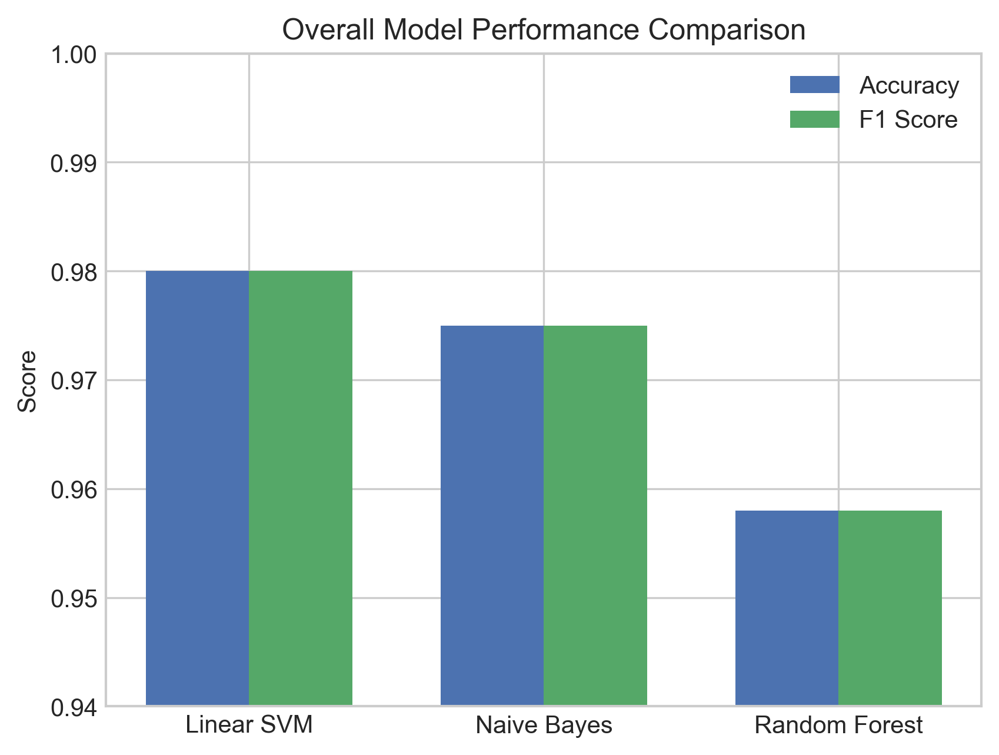
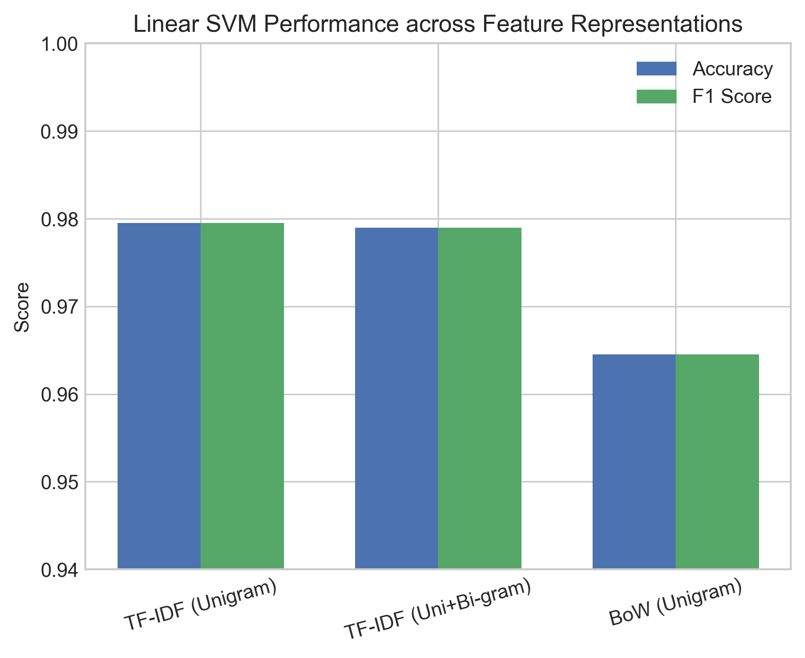
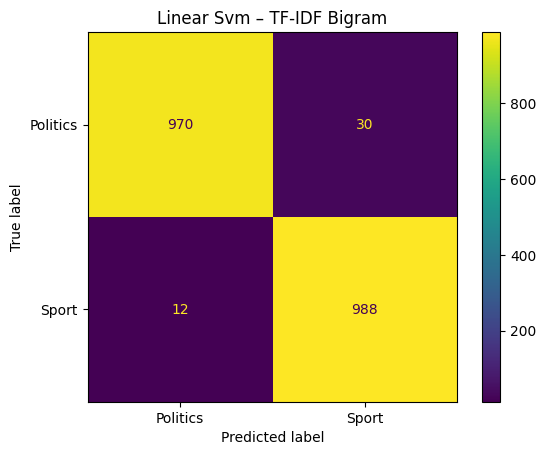
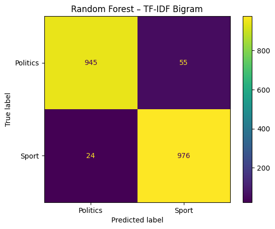

# Sports vs Politics Text Classification

This project presents a **binary text classification system** designed to distinguish between **Sports** and **Politics** news articles using classical machine learning techniques and different feature representations.

The work was completed as part of an academic assignment in **Natural Language Processing**.

---

## 📌 Project Overview

The objective of this study is to:
- Build a reliable **binary news classifier**.
- Compare multiple **machine learning models**.
- Evaluate different **text feature representations**.
- Perform **error analysis** and identify **system limitations**.

The final system achieves **~98% accuracy** using **Linear SVM with TF-IDF features**.

---

## 🗂 Dataset

- **Source:** AG News Dataset
- **Original categories:** *World, Sports, Business, Sci/Tech*
- **Classes used in this project:**
  - **World → Politics**
  - **Sports → Sports**

### Dataset Size (after balancing & reduction)

| Split | Samples per Class | Total |
|-------|-------------------|-------|
| Train | 10,000            | 20,000|
| Test  | 1,000             | 2,000 |

The dataset is kept **perfectly balanced** to ensure unbiased learning and evaluation.

---

## ⚙️ Preprocessing Steps

The following preprocessing pipeline was applied:
1. **Lowercasing** all text.
2. **Cleaning:** Removing punctuation and non-alphabetic symbols.
3. **Stop-word removal:** Filtering out common filler words.
4. **Vectorization:** TF-IDF conversion for numerical representation.

---

## 🧠 Machine Learning Models

Three classical supervised learning algorithms were evaluated:
- **Multinomial Naive Bayes:** Probabilistic approach.
- **Linear Support Vector Machine (SVM):** Margin-based approach.
- **Random Forest:** Ensemble tree-based approach.

---

## 📊 Quantitative Results

### Overall Model Performance

| Model | Accuracy | F1-Score |
|-------|----------|----------|
| **Linear SVM** | **0.9800** | **0.9800** |
| Naive Bayes | 0.9750 | 0.9750 |
| Random Forest | 0.9580 | 0.9580 |

📈 **Visualization**


---

### Feature Representation Comparison (Linear SVM)

| Representation | Accuracy | F1-Score |
|----------------|----------|----------|
| **TF-IDF (Unigram)** | **0.9795** | **0.9795** |
| TF-IDF (Uni+Bi-gram) | 0.9790 | 0.9790 |
| Bag of Words (Unigram) | 0.9645 | 0.9645 |

📈 **Visualization**


---

## 🔎 Confusion Matrix Analysis

### Model Comparison (TF-IDF Bigram)

| Naive Bayes | Linear SVM | Random Forest |
|:---:|:---:|:---:|
|  |  |  |

These matrices show that **Linear SVM produces the fewest misclassifications**, confirming its superior performance.

---

## 🧩 Feature Importance Insights

Top indicative words learned by the model:
- **Sports:** `team`, `coach`, `cup`, `league`, `season`, `players`, `olympic`, `game`
- **Politics:** `election`, `minister`, `government`, `president`, `nuclear`, `security`

This demonstrates that the classifier primarily relies on **topic-specific vocabulary**.

---

## ⚠️ Limitations

Despite strong accuracy, the system has important constraints:
- **Semantic ambiguity:** Words may appear in both domains (e.g., “minister of sports”).
- **Temporal bias:** Political vocabulary reflects a specific historical period (e.g., mentions of specific politicians).
- **Keyword dependence:** Lacks deep contextual understanding or word order awareness.
- **No semantic embeddings:** Classical TF-IDF ignores relationships between synonymous words.

---

## 🏁 Conclusion

This project shows that **classical machine learning** combined with **TF-IDF** can achieve **near-98% accuracy** for structured news classification.

> **Linear SVM with TF-IDF** provides the best balance of accuracy, robustness, and computational efficiency.

---

## 📂 Repository Structure
```text
├── Results/
│   ├── model_performance_bar.png
│   ├── feature_performance_bar.png
│   └── cm_model_*.png
├── data/
|   ├── train_processed.csv
|   ├── test_processed.csv
├── B23CM1036_prob4.py
├── B23CM1036_prob4.pdf
└── README.md
